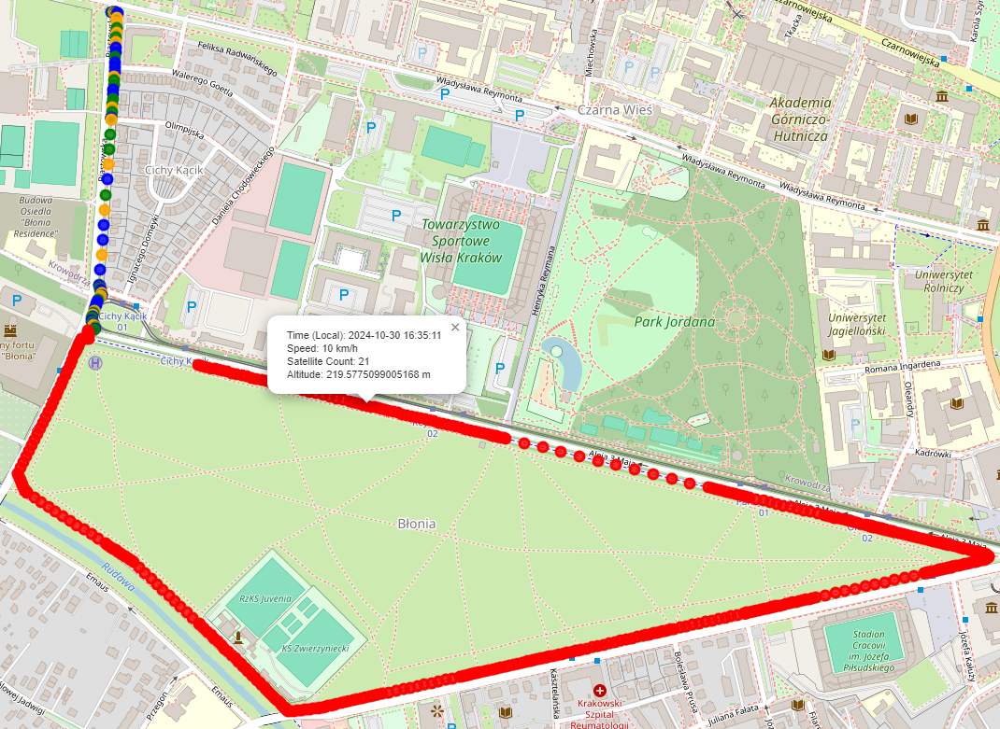

# GPS USB Data Logger

This project logs GPS data from the GPSD daemon to a JSON file on a USB pendrive, providing offline data storage and easy access to GPS information. The data is continuously logged, even if the USB drive is temporarily disconnected, using a multithreaded Python script. The system remounts the USB drive if it becomes unmounted, ensuring data continuity.

## Features
- **GPS Data Logging**: Collects latitude, longitude, altitude, speed, and satellite information.
- **Offline Storage**: Saves GPS data locally in JSON format on a USB pendrive.
- **Auto-Remount**: Automatically remounts the USB drive if disconnected.
- **Systemd Compatible**: Can be configured to run as a systemd service for automatic startup on boot.

## Project Structure
- **gps_logger.py**: Main script to collect GPS data and write it to a USB drive.
- **gps_data.json**: JSON file on the USB pendrive where GPS data is stored.


## Setup Instructions
1. **Connect GPSD**: Ensure `gpsd` daemon is running and properly configured to provide GPS data.
    - In order to ensure `gpsd` consistently provides GPS data, additional configuration in `/etc/default/gpsd` is required.
    ```sh
    sudo nano /etc/default/gpsd
    ```
    ```sh
    START_DAEMON="true"
    GPSD_OPTIONS="-n"
    DEVICES="/dev/ttyACM0"
    USBAUTO="true"
    GPSD_SOCKET="/var/run/gpsd.sock"
    ```
    ```sh
    sudo systemctl stop gpsd.service
    sudo systemctl stop gpsd.socket

    sudo systemctl disable gpsd.service
    sudo systemctl disable gpsd.socket

    sudo systemctl enable gpsd.service
    sudo systemctl enable gpsd.socket

    sudo systemctl restart gpsd
    ```

2. **USB Configuration**:
   - Ensure your USB drive is formatted and identified by its UUID.
   - Update the `UUID` variable in `gps_logger.py` to match your USB drive's UUID.
    ```sh
    lsblk -o NAME,UUID,MOUNTPOINT
    ```   

3. **System Requirements**:
   - Install necessary dependencies in a Python virtual environment.
    ```sh
    python3 -m venv gps-venv
    source gps-venv/bin/activate
    pip install -r requirements.txt
    ```

4. **Create the Systemd Service File**:
    - To run `gps_logger.py` as a service on boot, create a service file for systemd:
    1. Open a new file in the `/etc/systemd/system/` directory:
        ```sh
        sudo nano /etc/systemd/system/gps_logger.service
        ```
    2. Paste the following configuration into the file:
        ```sh
        [Unit]
        Description=GPS Logger to USB Pendrive
        After=gpsd.service

        [Service]
        ExecStart=/home/pi/gps-venv/bin/python /home/pi/gps/gps_logger.py
        WorkingDirectory=/home/pi/gps
        User=root
        Environment="PATH=/home/pi/gps-venv/bin:$PATH"
        Restart=always
        RestartSec=5

        [Install]
        WantedBy=multi-user.target
        ```

5. **Systemd Service Configuration**:
   - Configure and enable the `gps_logger.py` service to start logging GPS data on USB disk.
    ```sh
    sudo systemctl daemon-reload
    sudo systemctl enable gps_logger.service
    sudo systemctl start gps_logger.service

    sudo systemctl status gps_logger.service
    ```

6. **Log Monitoring**:
   - To view logs generated by `gps_logger.service`, which can help in debugging:
    ```sh
    sudo journalctl -u gps_logger.service -f
    ```

7. **Updating the Service**:
   - If changes are made to `gps_logger.py` or the service file, reload and restart the service:
    ```sh
    sudo systemctl daemon-reload
    sudo systemctl restart gps_logger.service
    ```


# Result


### Description of `gps_logger.py`

The `gps_logger.py` script continuously logs GPS data to a USB drive, ensuring reliable storage even if the drive disconnects temporarily. Key functions include:

- **GPS Data Collection**: Connects to `gpsd` to read and buffer GPS data (latitude, longitude, altitude, speed, etc.) using a separate thread.
- **USB Mount Management**: Ensures the USB drive is mounted at `/mnt/pendrive`. It automatically remounts if disconnected, maintaining data availability.
- **Data Storage**: Periodically writes buffered GPS data to `gps_data.json` on the USB drive. If the file exists, it appends new data; if not, it creates the file.
- **Error Handling**: Detects disconnections during writing, attempts to remount, and logs any issues. Clears the buffer after each successful write.

This script is designed for continuous, reliable GPS data logging to a USB drive, handling disconnections automatically.

---

### Description of `gps_data_processing.py`

The `gps_data_processing.py` script processes and visualizes the GPS data logged by `gps_logger.py`. Key functionalities include:

- **Data Parsing**: Reads and structures GPS data from `gps_data.json`.
- **Map Visualization**: Generates an interactive map with the GPS route, color-coded by speed, altitude, and other metrics. Markers along the route show details when clicked.
- **Route Animation**: Animates the recorded path to show travel progression over time.
- **Time Conversion**: Converts timestamps from UTC to local time for better readability.
- **HTML Export**: Saves the final interactive map as `animated_map.html` for easy viewing in a browser.

This script transforms raw GPS logs into an interactive format, making it easy to review and analyze travel routes.
